# AI-Powered Headless Portfolio Builder

A high-performance, headless portfolio builder using WordPress as the CMS and a lightning-fast SvelteKit frontend. Features AI-powered content generation, full i18n & RTL support, and a modern, decoupled architecture.

<p align="center">
  <a href="YOUR_LIVE_DEMO_URL_HERE"><strong>🚀 View Live Demo »</strong></a>
</p>

<p align="center">
  
  
  
  
  
  
</p>


## 🎯 Key Features

- **Headless Architecture:** Content managed in WordPress, served via its REST API.
- **Blazing-Fast Frontend:** Built with SvelteKit for an optimal, snappy user experience.
- **AI-Powered Content Assistance:** Integrated AI helps generate project descriptions in WordPress.
- **Multi-Language & RTL Support:** Fully functional in English and Persian (Farsi).
- **Mobile-First Responsive Design:** Looks and functions beautifully on all devices.
- **Automated Backups:** A nightly cron job backs up the MySQL database.
- **Custom WordPress Development:** Includes a custom child theme and plugin.

## 🗺️ Project Roadmap & Status

This project was developed in phases. Here is the current status:

- [x] **Phase 1:** Foundations and Local Environment Setup (XAMPP, Git, VSCode).
- [x] **Phase 2:** WordPress as a Headless CMS (Custom Post Types, ACF).
- [x] **Phase 3:** Svelte.js Frontend Development (API Fetching, Component Creation).
- [x] **Phase 4:** UI/UX Design and Styling (Figma, TailwindCSS, Responsiveness).
- [x] **Phase 5:** Advanced Features (Multi-language, RTL Support).
- [x] **Phase 6:** AI and Automation (AI Content Helper, Cron Job for Backups).
- [x] **Phase 7:** Custom WordPress Development (Child Theme, Shortcode Plugin).
- [ ] **Future:** Implement user authentication for private projects.
- [ ] **Future:** Add a full-text search functionality on the frontend.

## 🏗️ Architecture & Flow

Here is a high-level overview of the project's architecture:

```mermaid
graph TD;
    subgraph "User Interaction"
        User[👤 User visits the website] --> SvelteKit;
    end

    subgraph "Frontend (SvelteKit)"
        SvelteKit[⚡ SvelteKit Frontend] -->|"1. Fetches data"| API;
        API{🌐 WordPress REST API};
        SvelteKit -->|"4. Renders content"| RenderedPage[🖼️ Displays the portfolio];
    end

    subgraph "Backend (WordPress CMS)"
        API -->|"2. Requests content"| WordPress;
        WordPress[🐘 WordPress Backend] -->|"3. Queries database"| DB[(🗄️ MySQL Database)];
        Admin[👩‍💻 Admin manages content] --> WordPress;
        AI[🤖 AI Content Assistant] -->|Helps admin| Admin;
    end

    style User fill:#D6EAF8,stroke:#333,stroke-width:2px
    style RenderedPage fill:#D5F5E3,stroke:#333,stroke-width:2px
```



## 🛠️ Tech Stack

<details>
  <summary><strong>Click to see the full list of technologies used</strong></summary>

| Category      | Technology / Tool                                                                                                                                                                                                                                                                                                                          |
|---------------|--------------------------------------------------------------------------------------------------------------------------------------------------------------------------------------------------------------------------------------------------------------------------------------------------------------------------------------------|
| **Frontend**  |  SvelteKit,  Tailwind CSS,  Bootstrap |
| **Backend**   |  PHP,  WordPress (Headless),  ACF,  MySQL |
| **DevOps & Tooling** |  Apache,  Git,  GitHub,  VSCode, Cron Job |

</details>

## ⚙️ Getting Started

> [!NOTE]
> To run this project locally, you will need **XAMPP**, **Git**, and **Node.js** (v16+) installed on your machine.

### 1. Clone the Repository

```sh
git clone https://github.com/zrahabibi/portfolio.git
cd portfolio
```

### 2. Backend Setup (WordPress)
<details>
  <summary>Click to expand WordPress setup instructions</summary>

  1.  Start **Apache** and **MySQL** from the XAMPP control panel.
  2.  Create a new MySQL database named `portfolio-cms`.
  3.  Move the `backend/wordpress` folder to your XAMPP `htdocs` directory.
  4.  Navigate to `http://localhost/wordpress` and complete the installation.
  5.  Log in, install the **ACF** plugin, and activate the **"Hello Elementor child"** theme.
  6.  Add some sample projects under the "Projects" post type.

</details>

### 3. Frontend Setup (SvelteKit)
<details>
  <summary>Click to expand SvelteKit setup instructions</summary>

  1.  Navigate to the `frontend` directory: `cd frontend`
  2.  Install dependencies:
      ```sh
      npm install
      ```
  3.  Create your environment file:
      ```sh
      cp .env.example .env
      ```
  4.  Set your API URL in the `.env` file:
      ```env
      VITE_WP_API_URL="http://localhost/wordpress/wp-json/wp/v2"
      ```
  5.  Start the dev server:
      ```sh
      npm run dev
      ```
  > Your SvelteKit frontend is now live at **http://localhost:5173**!

</details>

## 🤝 Contributing

Contributions are welcome! Please feel free to fork the repo, create a feature branch, and open a Pull Request.

1.  Fork the Project
2.  Create your Feature Branch (`git checkout -b feature/AmazingFeature`)
3.  Commit your Changes (`git commit -m 'Add some AmazingFeature'`)
4.  Push to the Branch (`git push origin feature/AmazingFeature`)
5.  Open a Pull Request

## 📄 License

Distributed under the MIT License. See `LICENSE.txt` for more information.

## 📬 Contact

Zahra Habibi - [izarahabibi01@gmail.com](mailto:izarahabibi01@gmail.com)

Project Link: [https://github.com/zrahabibi/portfolio](https://github.com/zrahabibi/portfolio)