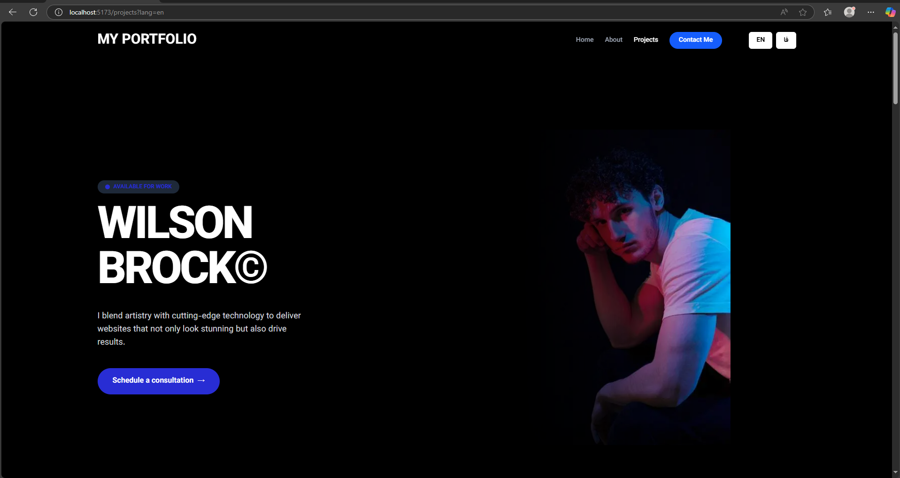

AI-Powered Headless Portfolio Builder

A dynamic, personal portfolio website builder that leverages the power of WordPress as a headless CMS and a lightning-fast Svelte.js frontend. This project features multi-language support (including RTL), responsive design, and AI-powered content assistance directly within the WordPress admin panel.

✨ Live Demo & Screenshots

[➡️ View Live Demo]([REPLACE WITH YOUR DEPLOYED URL])

🚀 About The Project

The goal of this project was to create a modern, flexible, and high-performance portfolio system. By decoupling the frontend from the backend (a "headless" approach), we achieve several key advantages:

Performance: The Svelte.js frontend is incredibly fast and lightweight, providing a superior user experience.

Flexibility: The content is managed in the user-friendly WordPress interface, but the frontend can be rebuilt or swapped out with any technology without affecting the content.

Security: The attack surface is reduced as the frontend and backend are separate entities.

Developer Experience: Combines the world's most popular CMS for content management with a modern JavaScript framework for building interfaces.

🎯 Key Features

Headless Architecture: Content is managed in WordPress and served via its REST API.

Blazing-Fast Frontend: Built with SvelteKit for an optimal, snappy user experience.

AI-Powered Content Assistance: Integrated AI helps generate project descriptions directly in the WordPress editor.

Multi-Language & RTL Support: Fully functional in English and Persian (Farsi) with a seamless language switcher and correct Right-to-Left (RTL) layout.

Fully Responsive: A "mobile-first" design that looks great on all devices, from phones to desktops.

Automated Backups: A nightly cron job automatically backs up the MySQL database.

Custom WordPress Development: Includes a custom child theme and a simple shortcode plugin.

🛠️ Tech Stack

A look at the major technologies and tools used in this project.

Frontend	Backend & DevOps	Tools & Concepts

HTML5 & CSS3

ACF Plugin
XAMPP

	

Cron Job
REST API & JSON

⚙️ Getting Started

To get a local copy up and running, follow these steps.

Prerequisites

XAMPP: A local server environment. Download XAMPP

Git: Version control. Install Git

Node.js: JavaScript runtime (v16 or higher). Install Node.js

Installation

Clone the Repository

Generated sh
git clone https://github.com/zrahabibi/portfolio.git
cd portfolio

Backend Setup (WordPress)

Start Apache and MySQL from the XAMPP control panel.

Create a new MySQL database named "portfolio-cms" using phpMyAdmin (http://localhost/phpmyadmin).

Move the backend/wordpress folder to your XAMPP htdocs directory.

Navigate to http://localhost/wordpress in your browser and follow the WordPress installation steps, using the database name, user (root), and password (leave blank by default) you just configured.

Log in to the WordPress admin panel (http://localhost/wordpress/wp-admin).

Install and activate the Advanced Custom Fields (ACF) plugin.

Activate the "Hello Elmementor child" child theme and the [YOUR_PLUGIN_NAME] plugin.

Go to ACF -> Tools and import the [REPLACE_WITH_ACF_EXPORT_FILE.json] file to set up the "Projects" custom fields.

Navigate to the "Projects" custom post type and add a few sample projects.

Frontend Setup (SvelteKit)

Navigate to the frontend directory:

Generated sh
cd frontend
IGNORE_WHEN_COPYING_START
content_copy
download
Use code with caution.
Sh
IGNORE_WHEN_COPYING_END

Install NPM packages:

Generated sh
npm install
IGNORE_WHEN_COPYING_START
content_copy
download
Use code with caution.
Sh
IGNORE_WHEN_COPYING_END

Create an environment file by copying the example:

Generated sh
cp .env.example .env
IGNORE_WHEN_COPYING_START
content_copy
download
Use code with caution.
Sh
IGNORE_WHEN_COPYING_END

Open the .env file and set the WordPress API endpoint:

Generated env
# .env
VITE_WP_API_URL="http://localhost/wordpress/wp-json/wp/v2"
IGNORE_WHEN_COPYING_START
content_copy
download
Use code with caution.
Env
IGNORE_WHEN_COPYING_END

Start the development server:

Generated sh
npm run dev
IGNORE_WHEN_COPYING_START
content_copy
download
Use code with caution.
Sh
IGNORE_WHEN_COPYING_END

Open your browser and visit http://localhost:5173 to see your SvelteKit frontend!

🗺️ Project Roadmap & Learning Path

This project was developed in distinct phases to build skills incrementally.

✅ Phase 1: Foundations and Setup

Set up the complete local development environment (XAMPP, Git, VSCode).

Installed WordPress on the local Apache server.

✅ Phase 2: WordPress as a Headless CMS

Created a custom post type "Projects".

Used the ACF plugin to define custom fields (description, tech, URL, images).

Populated the CMS with sample project data.

✅ Phase 3: Svelte.js Frontend

Initialized a new SvelteKit project.

Fetched data from the WordPress REST API using AJAX requests.

Created Svelte components to display the project data.

✅ Phase 4: Design, Styling, and Responsiveness

Designed the UI/UX in Figma.

Styled the frontend using TailwindCSS for layout and Bootstrap for components.

Added subtle animations, hovers, and transitions.

Ensured a fully responsive, mobile-first design.

✅ Phase 5: Advanced Features

Implemented multi-language support for Persian (Farsi) by duplicating ACF fields.

Created a language switcher on the frontend.

Applied custom CSS for proper Right-to-Left (RTL) layout.

✅ Phase 6: AI and Automation

Integrated a text-generation AI API to suggest project descriptions within the WordPress editor.

Set up a local cron job to run a PHP script for nightly database backups.

✅ Phase 7: Custom WordPress Development

Created a simple child theme to safely customize styles.

Developed a basic plugin to provide a [project_count] shortcode.

🤝 Contributing

Contributions are what make the open-source community such an amazing place to learn, inspire, and create. Any contributions you make are greatly appreciated.

If you have a suggestion that would make this better, please fork the repo and create a pull request. You can also simply open an issue with the tag "enhancement".

Fork the Project

Create your Feature Branch (git checkout -b feature/AmazingFeature)

Commit your Changes (git commit -m 'Add some AmazingFeature')

Push to the Branch (git push origin feature/AmazingFeature)

Open a Pull Request

📄 License

Distributed under the MIT License. See LICENSE.txt for more information.

📬 Contact

Zahra Habibi - izarahabibi01@gmail.com

Project Link: https://github.com/zrahabibi/portfolio

🙏 Acknowledgments

A big thank you to the following resources that were invaluable during the development of this project:

SvelteKit Documentation

WordPress REST API Handbook

headlesswp.org

rodneylab.com for excellent Svelte and headless tutorials.