```mermaid
graph TD;
    subgraph "User Interaction"
        User[👤 User visits the website] --> SvelteKit;
    end

    subgraph "Frontend (SvelteKit)"
        SvelteKit[⚡ SvelteKit Frontend] -->|"1. Fetches data"| API;
        API{🌐 WordPress REST API};
        SvelteKit -->|"4. Renders content"| RenderedPage[🖼️ Displays the portfolio];
    end

    subgraph "Backend (WordPress CMS)"
        API -->|"2. Requests content"| WordPress;
        WordPress[🐘 WordPress Backend] -->|"3. Queries database"| DB[(🗄️ MySQL Database)];
        Admin[👩‍💻 Admin manages content] --> WordPress;
        AI[🤖 AI Content Assistant] -->|Helps admin| Admin;
    end

    style User fill:#D6EAF8,stroke:#333,stroke-width:2px
    style RenderedPage fill:#D5F5E3,stroke:#333,stroke-width:2px
```

AI-Powered Headless Portfolio Builder

A high-performance, headless portfolio builder using WordPress as the CMS and a lightning-fast SvelteKit frontend. Features AI-powered content generation, full i18n & RTL support, and a modern, decoupled architecture.

🚀 About The Project

This project demonstrates a modern approach to web development by decoupling the content management system from the presentation layer. Using WordPress as a headless CMS provides a familiar, user-friendly interface for content creators, while the SvelteKit frontend delivers a superior, high-performance experience for end-users.

This architecture solves several key challenges:

Performance: The statically-generated frontend is incredibly fast, eliminating backend rendering bottlenecks.

Flexibility: The frontend can be rebuilt with any technology without affecting the content, making the system future-proof.

Security: The attack surface is minimized by separating the public-facing application from the WordPress admin and database.

Developer Experience: It combines the world's most popular CMS with a modern JavaScript framework, leveraging the best of both worlds.

______________________________________________________________________________________________

🎯 Key Features

Headless Architecture: Content managed in WordPress, served via its REST API.

Blazing-Fast Frontend: Built with SvelteKit for an optimal, snappy user experience.

AI-Powered Content Assistance: Integrated AI helps generate project descriptions directly within the WordPress editor.

Multi-Language & RTL Support: Fully functional in English and Persian (Farsi) with a seamless language switcher and correct Right-to-Left (RTL) styling.

Mobile-First Responsive Design: Looks and functions beautifully on all devices.

Automated Backups: A nightly cron job automatically backs up the MySQL database.

Custom WordPress Development: Includes a custom child theme and a plugin for shortcode functionality.

______________________________________________________________________________________________

🛠️ Tech Stack

Frontend:

SvelteKit

Tailwind CSS

Bootstrap

JavaScript (ES6+)

Backend:

PHP

WordPress (as Headless CMS)

Advanced Custom Fields (ACF) Plugin

MySQL

DevOps & Tooling:

Apache (via XAMPP)

Git &

GitHub

VSCode

Figma

Cron Job for automated tasks.

______________________________________________________________________________________________

⚙️ Getting Started

To get a local copy up and running, follow these steps.

Prerequisites

XAMPP: For a local Apache/MySQL environment. Download XAMPP

Git: For version control. Install Git

Node.js: JavaScript runtime (v16 or higher). Install Node.js

Installation

Clone the Repository

Generated sh
git clone https://github.com/zrahabibi/portfolio.git
cd portfolio

______________________________________________________________________________________________

Setup the Backend (WordPress)

Click to expand WordPress setup instructions

Start Apache and MySQL from the XAMPP control panel.

Create a new MySQL database named portfolio-cms using phpMyAdmin (http://localhost/phpmyadmin).

Move the backend/wordpress folder to your XAMPP htdocs directory.

Navigate to http://localhost/portfolio-cms/wordpress-6.8.1 and follow the WordPress installation steps.

Database Name: portfolio-cms

Username: root

Password: (leave blank by default)

Log in to the WordPress admin panel (http://localhost/portfolio-cms/wordpress-6.8.1/wp-admin).

Install and activate the Advanced Custom Fields (ACF) plugin.

Activate the "Hello Elementor child" theme from Appearance > Themes.

Navigate to the "Projects" custom post type and add a few sample projects to populate the API.

______________________________________________________________________________________________

Setup the Frontend (SvelteKit)

Click to expand SvelteKit setup instructions

Navigate to the frontend directory:

Generated sh
cd frontend
IGNORE_WHEN_COPYING_START
content_copy
download
Use code with caution.
Sh
IGNORE_WHEN_COPYING_END

Install NPM packages:

Generated sh
npm install
IGNORE_WHEN_COPYING_START
content_copy
download
Use code with caution.
Sh
IGNORE_WHEN_COPYING_END

Create an environment file from the example:

Generated sh
cp .env.example .env
IGNORE_WHEN_COPYING_START
content_copy
download
Use code with caution.
Sh
IGNORE_WHEN_COPYING_END

Open the .env file and set the WordPress API endpoint:

Generated env
# .env
VITE_WP_API_URL="http://localhost/wordpress/wp-json/wp/v2"
IGNORE_WHEN_COPYING_START
content_copy
download
Use code with caution.
Env
IGNORE_WHEN_COPYING_END

Start the development server:

Generated sh
npm run dev
IGNORE_WHEN_COPYING_START
content_copy
download
Use code with caution.
Sh
IGNORE_WHEN_COPYING_END

Open your browser and visit http://localhost:5173 to see your portfolio!

______________________________________________________________________________________________

🏗️ Architecture & Core Concepts

This project is a practical demonstration of several key modern web development concepts.

Headless CMS: By using the WordPress REST API, the backend is purely a data source. This is achieved by creating a "Projects" Custom Post Type and defining its data structure with the Advanced Custom Fields (ACF) plugin. All content is exposed as structured JSON.

Frontend Data Fetching: The SvelteKit frontend consumes the REST API endpoints. It uses fetch requests on page/component load to pull in project data, ensuring the content is always up-to-date with the CMS.

Internationalization (i18n): Multi-language support is implemented by creating duplicate sets of ACF fields (e.g., project_description_en and project_description_fa). The SvelteKit frontend includes a language switcher that dynamically fetches and displays content from the appropriate fields.

RTL Styling: Custom CSS is applied conditionally when the Persian (Farsi) language is selected, ensuring all layouts, text-alignments, and element directions correctly adapt to a Right-to-Left reading order.

Automation: A local cron job is configured to execute a PHP script nightly, which uses mysqldump to create a secure backup of the WordPress database, demonstrating a key DevOps practice.

### Project Architecture Flow

______________________________________________________________________________________________

🤝 Contributing

Contributions make the open-source community an amazing place to learn, inspire, and create. Any contributions you make are greatly appreciated.

Fork the Project

Create your Feature Branch (git checkout -b feature/AmazingFeature)

Commit your Changes (git commit -m 'Add some AmazingFeature')

Push to the Branch (git push origin feature/AmazingFeature)

Open a Pull Request

______________________________________________________________________________________________

📄 License

Distributed under the MIT License. See LICENSE.txt for more information.

______________________________________________________________________________________________

📬 Contact

Zahra Habibi - izarahabibi01@gmail.com

Project Link: https://github.com/zrahabibi/portfolio

🙏 Acknowledgments

SvelteKit Documentation

WordPress REST API Handbook

Headless WordPress Community

Rodney Lab Tutorials